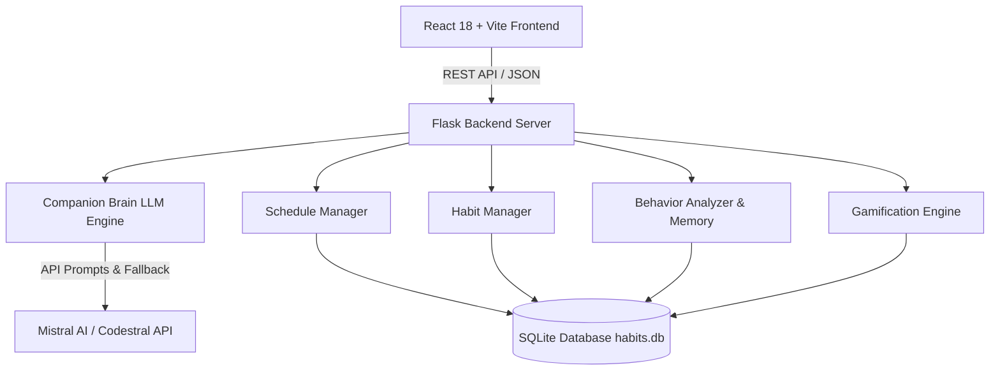

# 🌌 Lumi — Intelligent AI Habit & Schedule Companion

> An empathetic, permission-driven AI habit companion with behavioral memory, diurnal free-time discovery, adaptive friction recovery, and cosmic gamification.

[](https://react.dev/)
[](https://vitejs.dev/)
[](https://tailwindcss.com/)
[](https://python.org/)
[](https://flask.palletsprojects.com/)
[](https://mistral.ai/)
[](https://sqlite.org/)

---

## 📖 Table of Contents

- [Overview](#-overview)
- [Key Features](#-key-features)
- [System Architecture](#-system-architecture)
- [Project Structure](#-project-structure)
- [Getting Started](#-getting-started)
  - [Prerequisites](#prerequisites)
  - [Backend Setup](#backend-setup)
  - [Frontend Setup](#frontend-setup)
- [Conversational Commands & Triggers](#-conversational-commands--triggers)
- [API Endpoints](#-api-endpoints)
- [Database Schema](#-database-schema)
- [Running Tests](#-running-tests)
- [License](#-license)

---

## 🌟 Overview

Traditional habit trackers are rigid checklist databases: they auto-fill schedules without asking permission, treat missed habits like moral failures, and provide zero contextual reasoning.

**Lumi** transforms habit building into an interactive partnership:
1. **Permission-Driven Scheduling**: Never auto-injects habits. Lumi scans your calendar, finds 3–4 diurnal candidate windows (🌅 Morning, ☀️ Afternoon, 🌇 Evening, 🌙 Night), explains its reasoning, and asks for your consent.
2. **Behavioral Memory Intelligence**: Tracks your diurnal completion patterns and learns when you thrive and where you experience friction.
3. **Adaptive Habit Rescue**: If you miss a habit or feel overwhelmed, Lumi offers 1-tap friction remedies (shorten duration, adjust timing, take a rest day) rather than breaking streaks.
4. **Empathetic Companion Brain**: Distinguishes between habit requests, emotional stress, broad goal exploration, and schedule modifications.

---

## ⚡ Key Features

### 🤖 1. Lumi AI Companion (`companion_brain.py`)
- **Diurnal Time Windows**: Discovers realistic slots across Morning, Afternoon, Evening, and Night based on your free time.
- **Confirmation Flow**: Proposes changes with overlap detection (e.g., warnings for overlapping classes or study sessions) and commits only when you confirm.
- **Overwhelm & Stress Support**: When you express fatigue or pressure, Lumi validates your feelings and offers interactive reflection chips (`🎓 Classes`, `💼 Work`, `🎯 Too many habits`, `🔋 Need rest`).
- **Goal Exploration**: Helps refine broad aspirations (e.g. *"I want to get fit"*) into specific actionable habits.
- **Habit Struggle Safeguard**: Negative phrases (*"i cant do my habit"*, *"can't do it"*) trigger empathy and adjustment options rather than creating bogus habits.

### 📅 2. Routine Matrix & Schedule View (`ScheduleView.jsx`)
- **Collapsed Daily Cards**: Clean cards that expand on demand with a global *Expand / Collapse All* toggle.
- **24-Hour Week Grid**: Timeline visualization of your weekly 24-hour cycle with glowing AI free-slot indicators.
- **Direct Habit & Block Management**: Delete or edit habits and schedule blocks directly from the schedule canvas.
- **1-Click Category Presets**: Quick-insert buttons for Sleep, Meals, Classes, Work, Gym, Study, and Deep Work.
- **Day Cloning & Batch Addition**: Copy a full day's routine to multiple days in one click.

### 🎮 3. Cosmic Gamification & XP Engine (`gamification_engine.py`)
- **XP Progression**: Earn +50 XP for habit creation, +25 XP for check-ins, and bonus multipliers for consistent streaks.
- **Dynamic Levels & Cosmic Tiers**: Level up from *Cosmic Novice* to *Stellar Voyager* and *Celestial Master*.
- **Streak Health**: Visual flame indicators and milestone celebration confetti.

### 🎭 4. Multi-Personality Switcher
- **🔥 High-Energy Hype Coach**: Upbeat, electrifying, celebrates every win like a championship victory.
- **🌱 Mindful & Hopeful Partner**: Gentle, soothing, deeply compassionate, and focused on sustainable growth.
- **🎯 Pragmatic & Direct Strategist**: Concise, analytical, highly efficient, zero fluff.
- **✨ Playful & Quirky Buddy**: Witty, humorous, lighthearted, and full of fun analogies.

---

## 🏛 System Architecture



---

## 📂 Project Structure

```text
habit_tracker/
├── backend/
│   ├── app.py                  # Flask application & REST API routes
│   ├── companion_brain.py      # LLM orchestration, intent classifier & memory
│   ├── habit_manager.py        # Habit lifecycle, slot calculation & validation
│   ├── schedule_manager.py     # 24h routine matrix, free gaps & batch ops
│   ├── behavior_analyzer.py    # Diurnal stats, friction analysis & recommendations
│   ├── gamification_engine.py  # XP calculation, levels & cosmic tiers
│   ├── db.py                   # SQLite schema initialization & database helpers
│   ├── habits.db               # SQLite database file
│   ├── requirements.txt        # Python package dependencies
│   ├── test_personality.py     # Companion intelligence & flow unit tests
│   ├── test_core.py            # Core engine unit tests
│   └── test_e2e_live.py        # Live end-to-end integration tests
│
├── frontend/
│   ├── src/
│   │   ├── components/
│   │   │   ├── ChatView.jsx            # Interactive AI chat interface & action cards
│   │   │   ├── ScheduleView.jsx        # Weekly matrix & 24h timeline grid
│   │   │   ├── HabitsView.jsx          # Active habits & 1-tap check-in cards
│   │   │   ├── StatsView.jsx           # Diurnal analytics, streaks & completion charts
│   │   │   ├── Navbar.jsx              # Navigation, XP counter & personality pill
│   │   │   ├── PersonalityModal.jsx    # Personality selector dialog
│   │   │   ├── TimeRangeSlider.jsx     # Dual-handle 24-hour time selector
│   │   │   └── CategoryPresets.js      # Color tokens, emojis & default intervals
│   │   ├── services/
│   │   │   └── api.js                  # Axios/Fetch API client
│   │   ├── App.jsx                     # Top-level state & tab orchestration
│   │   ├── index.css                   # Cosmic glassmorphism & Tailwind design system
│   │   └── main.jsx                    # React entry point
│   ├── package.json
│   ├── tailwind.config.js
│   └── vite.config.js
│
└── README.md
```

---

### ⚡ Quick Start (Windows 1-Click Runner)

Simply double-click or run:
```cmd
run.bat
```
*(or `start.bat`)*

This automated script will:
1. Check Python & Node.js environments
2. Create & configure the Python virtual environment (`backend/venv`)
3. Install missing backend and frontend dependencies
4. Build the production React frontend (`npm run build`)
5. Launch both the Flask Backend (port 5000) and Vite Frontend (port 3000)
6. Open your default browser to `http://localhost:3000`

To stop all running servers:
```cmd
stop.bat
```

---

### Manual Setup

#### Backend Setup

1. **Navigate to the backend directory**:
   ```bash
   cd backend
   ```

2. **Create and activate a virtual environment**:
   ```bash
   # Windows (PowerShell)
   python -m venv venv
   .\venv\Scripts\activate

   # macOS / Linux
   python3 -m venv venv
   source venv/bin/activate
   ```

3. **Install dependencies**:
   ```bash
   pip install -r requirements.txt
   ```

4. **Configure Environment Variables**:
   Create a `.env` file in the `backend/` directory:
   ```env
   MISTRAL_API_KEY=your_mistral_api_key_here
   PORT=5000
   ```
   *(Note: If no API key is provided, Lumi operates in built-in offline heuristic mode).*

5. **Start the Flask backend server**:
   ```bash
   python app.py
   ```
   *Backend will start on `http://localhost:5000`.*

---

### Frontend Setup

1. **Navigate to the frontend directory**:
   ```bash
   cd ../frontend
   ```

2. **Install npm dependencies**:
   ```bash
   npm install
   ```

3. **Start the Vite development server**:
   ```bash
   npm run dev
   ```
   *Frontend will start on `http://localhost:3000`.*

---

## 💬 Conversational Commands & Triggers

| Prompt Example | Intent / Action |
| :--- | :--- |
| `"I want to study 3 hours daily"` | Computes 4 candidate time windows with explanatory reasoning and asks for permission. |
| `"I have classes from 10:00 to 14:00 on Mondays"` | Generates a **Schedule Change Proposal Card** with conflict warnings and Confirm/Discard buttons. |
| `"When is my free time?"` | Summarizes daily free time windows and available gap durations across the week. |
| `"I'm overwhelmed"` | Empathetic stress-relief flow with clickable reflection options. |
| `"I want to get fit"` | Goal exploration with 1-tap focus chips (Cardio, Strength, Endurance, Health). |
| `"i cant do my habit"` | Habit struggle support offering duration reduction, rescheduling, or a rest day. |
| `"clean schedule"` / `"reset schedule"` | Clears all commitments from your weekly schedule matrix. |
| `"clear chat"` / Top-right **Clear Chat** button | Resets conversation history and restores fresh greeting canvas. |

---

## 📡 API Endpoints

### 💬 Chat & AI
- `POST /api/chat` — Send a message to Lumi and receive reply + action payload.
- `GET /api/chat-history/<user_id>` — Fetch chronological chat history.
- `DELETE /api/chat-history/<user_id>` — Clear chat history and pending actions.
- `POST /api/personality` — Switch active Lumi personality.

### 📅 Schedule Matrix
- `GET /api/schedule/<user_id>` — Retrieve user's 7-day schedule blocks.
- `POST /api/schedule` — Add or update a schedule commitment.
- `POST /api/schedule/batch` — Add a commitment across multiple days.
- `POST /api/schedule/clone` — Clone a day's schedule to other days.
- `DELETE /api/schedule/<user_id>/<block_id>` — Delete a specific schedule block.
- `DELETE /api/schedule/<user_id>/day/<day>` — Clear all commitments for a single day.
- `DELETE /api/schedule/<user_id>/all` — Clear entire weekly schedule canvas.
- `GET /api/free-slots/<user_id>` — Calculate free gap intervals across all 7 days.

### 🎯 Habits & Check-ins
- `GET /api/habits/<user_id>` — Fetch all active habits and current streaks.
- `POST /api/habits` — Manually create or customize a habit.
- `DELETE /api/habits/<habit_id>` — Delete/archive a habit.
- `POST /api/checkin` — Record a daily habit completion or adapt missed session.

### 📊 Analytics & Gamification
- `GET /api/stats/<user_id>` — Retrieve completion rates, streaks, and diurnal statistics.
- `GET /api/gamification/<user_id>` — Fetch current XP, level, cosmic tier, and badges.
- `GET /api/proactive/<user_id>` — Get proactive behavioral check-in suggestions.

---

## 🗄 Database Schema

The SQLite database (`habits.db`) comprises 7 relational tables:

```sql
-- 1. Users
CREATE TABLE users (
    id TEXT PRIMARY KEY,
    name TEXT NOT NULL,
    created_at TIMESTAMP DEFAULT CURRENT_TIMESTAMP
);

-- 2. Weekly Schedule Commitments
CREATE TABLE schedule (
    id INTEGER PRIMARY KEY AUTOINCREMENT,
    user_id TEXT NOT NULL,
    day_of_week TEXT NOT NULL,
    start_time TEXT NOT NULL,
    end_time TEXT NOT NULL,
    activity_label TEXT NOT NULL,
    is_free_time BOOLEAN DEFAULT 0,
    updated_at TIMESTAMP DEFAULT CURRENT_TIMESTAMP,
    FOREIGN KEY (user_id) REFERENCES users (id) ON DELETE CASCADE
);

-- 3. Habits
CREATE TABLE habits (
    id INTEGER PRIMARY KEY AUTOINCREMENT,
    user_id TEXT NOT NULL,
    name TEXT NOT NULL,
    target_time TEXT NOT NULL,
    duration_minutes INTEGER NOT NULL,
    frequency TEXT NOT NULL,
    status TEXT DEFAULT 'active',
    created_at TIMESTAMP DEFAULT CURRENT_TIMESTAMP,
    last_modified_at TIMESTAMP DEFAULT CURRENT_TIMESTAMP,
    FOREIGN KEY (user_id) REFERENCES users (id) ON DELETE CASCADE
);

-- 4. Check-ins & Adaptations
CREATE TABLE checkins (
    id INTEGER PRIMARY KEY AUTOINCREMENT,
    habit_id INTEGER NOT NULL,
    date TEXT NOT NULL,
    completed BOOLEAN NOT NULL,
    reason_if_missed TEXT,
    adapted_duration INTEGER,
    created_at TIMESTAMP DEFAULT CURRENT_TIMESTAMP,
    FOREIGN KEY (habit_id) REFERENCES habits (id) ON DELETE CASCADE
);

-- 5. Chat History
CREATE TABLE chat_history (
    id INTEGER PRIMARY KEY AUTOINCREMENT,
    user_id TEXT NOT NULL,
    role TEXT NOT NULL,
    message TEXT NOT NULL,
    created_at TIMESTAMP DEFAULT CURRENT_TIMESTAMP,
    FOREIGN KEY (user_id) REFERENCES users (id) ON DELETE CASCADE
);

-- 6. Pending Actions (Unconfirmed proposals / friction flows)
CREATE TABLE pending_actions (
    user_id TEXT PRIMARY KEY,
    action_type TEXT NOT NULL,
    payload TEXT NOT NULL,
    created_at TIMESTAMP DEFAULT CURRENT_TIMESTAMP,
    FOREIGN KEY (user_id) REFERENCES users (id) ON DELETE CASCADE
);

-- 7. Behavior Log
CREATE TABLE behavior_log (
    id INTEGER PRIMARY KEY AUTOINCREMENT,
    user_id TEXT NOT NULL,
    event_type TEXT NOT NULL,
    details TEXT,
    created_at TIMESTAMP DEFAULT CURRENT_TIMESTAMP,
    FOREIGN KEY (user_id) REFERENCES users (id) ON DELETE CASCADE
);
```

---

## 🧪 Running Tests

Run the complete test suite from the `backend/` directory:

```bash
# Run personality, flow, and prompt tests
python -m unittest test_personality.py

# Run core scheduling, streak, conflict, and API tests
python -m unittest test_core.py

# Run all tests together
python -m unittest discover -s . -p "test_*.py"
```

---

## 📄 License

This project is open source and available under the [MIT License](LICENSE).
